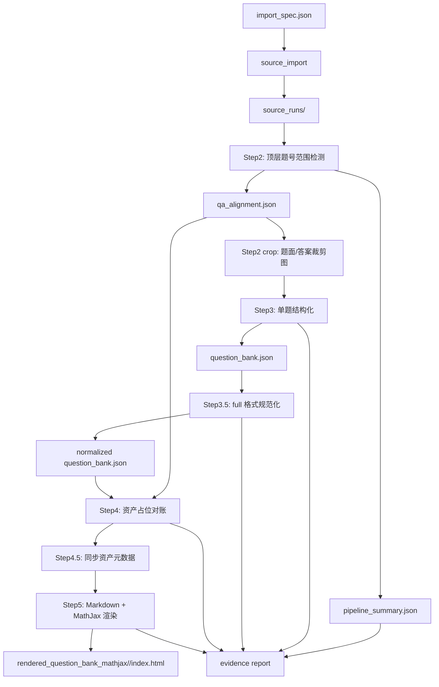
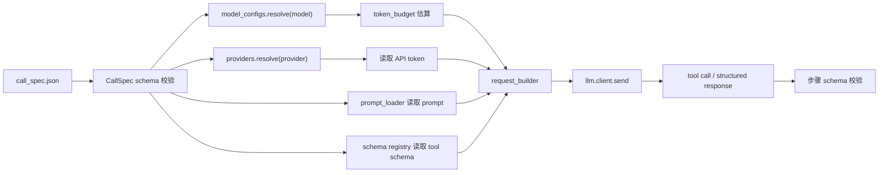

# v12 Runtime 重构整体架构

本文档定义 `exam-import` 的 v12 runtime 目标架构。v12 是一次干净重构，不承担旧步骤、旧 mode alias、旧扁平字段或旧中间产物的兼容责任。

## 1. 架构目标

v12 的目标是把数学试卷导入流程拆成边界清晰、可校验、可替换的模块：

- 输入模式统一为四种：`pure_paper`、`mixed`、`paper_plus_answer`、`answer_patch`。
- Step2 之后只使用 `qa_alignment.json` 作为主链路表，不再设计 `question_groups.json` 旁路。
- prompt、JSON Schema、算法契约外置，并作为运行代码的 source of truth。
- 大模型厂商规则、模型静态配置、单次调用配置分开存储。
- 每一步失败都应尽早暴露，不通过静默 fallback、手工改最终 JSON 或后处理掩盖流程问题。
- 完整流程结束后必须输出真实证据：成功数、错误数、审计结果、资产数量、同步数量和渲染入口。

## 2. 非目标

v12 不做以下事情：

- 不保留 `paper_plus_answer_file`、`answer_patch_for_existing_pure_paper` 等旧 mode alias。
- 不保留 Step2 旧扁平行字段，例如 `question_labels`、`question_core_labels`、`answer_items`。
- 不同时维护 `question_groups.json` 和 `qa_alignment.json` 两套题面分组来源。
- 不在 Step3、Step3.5、Step4 里补做上游应完成的范围检测。
- 不把模型调用失败转成“流程继续但结果缺失”的静默结果。
- 不手工修改最终 question bank 来绕过 schema、prompt 或脚本问题。

## 3. 目标目录结构

```text
<repo-root>/
  V12_REFACTOR_ARCHITECTURE.zh-CN.md
  V12_PROMPT_SCHEMA_LAYOUT.zh-CN.md
  provider_config/
    README.zh-CN.md
    providers/
      *.json
    models/
      *.json
  doc/
    zh_CN/
      step2_layout.md
      step2_qa_alignment_contract.md
      step2_crop_algorithm.md
      step3_question_json.md
      step35_latex_audit.md
      step4_assets.md
      step4_asset_placeholder_algorithm.md
      step5_render.md
      step_pipeline_processing_flow.md
  prompts/
    zh_CN/
      step2_layout.prompt.md
      step3_question_json.prompt.md
      step35_latex_audit.prompt.md
      step4_visual_assets.prompt.md
      step4_answer_tables.prompt.md
  call_specs/
    README.zh-CN.md
    step2_question_ranges.dashscope.qwen3.5-flash.tool_calling.json
    step3_question_json.dashscope.qwen3.5-flash.tool_calling.json
    step35_latex_audit.dashscope.qwen3.5-flash.tool_calling.json
    step4_visual_assets.dashscope.qwen3.5-flash.tool_calling.json
    step4_answer_tables.dashscope.qwen3.5-flash.tool_calling.json
  tool_schemas/
    step2_question_ranges.schema.json
    question_record.schema.json
    visual_asset_review.schema.json
    answer_table_review.schema.json
  exam_import/
    cli/
      check_contracts.py
      source_import.py
      run_pipeline.py
      answer_patch.py
      validate_spec.py
    core/
      paths.py
      run_context.py
      pipeline_state.py
      evidence.py
      io.py
    sources/
      mineru_extract.py
      source_run_writer.py
      page_assets.py
      ocr_blocks.py
    llm/
      providers.py
      model_configs.py
      call_spec_loader.py
      request_builder.py
      client.py
      response_parser.py
      token_budget.py
    prompts/
      loader.py
      registry.py
    schemas/
      call_spec.py
      import_spec.py
      question_ranges.py
      qa_alignment.py
      question_record.py
      visual_asset.py
      answer_table.py
      pipeline_summary.py
    steps/
      step2_layout.py
      step2_crop.py
      step2_runtime.py
      step3_question_json.py
      step35_normalize.py
      step4_assets.py
      step4_runtime.py
      step45_sync.py
      step5_render.py
    render/
      asset_export.py
      markdown_renderer.py
      asset_resolver.py
      mathjax_page.py
    tests/
      fixtures/
```

目录职责：

- `V12_PROMPT_SCHEMA_LAYOUT.zh-CN.md`：定义 prompt 文档、tool schema、运行时 schema 和步骤代码之间的分层边界。
- `doc/zh_CN/`：保存旧长版 prompt 契约文档、算法说明、流程说明和人工审阅资料，仅作为设计证据与追溯资料。
- `prompts/zh_CN/*.prompt.md`：保存运行时实际读取的中文 prompt，固定使用 `meta/system/user` 结构。
- `tool_schemas/`：保存真正发给 function calling / structured output 的独立 JSON Schema 文件。
- `exam_import/cli/`：只处理命令行参数、加载配置、调用业务模块。
- `exam_import/core/`：处理路径、run 上下文、流程状态、证据报告。
- `exam_import/sources/`：处理 PDF/OCR/source run，不理解 Step3 或 Step4 schema。
- `provider_config/`：保存 provider 和 model 的静态外置配置。
- `exam_import/llm/`：处理 provider/model 配置加载、单次调用配置、token 预算和请求发送。
- `exam_import/prompts/`：从外置 `*.prompt.md` 目录读取模板，不再依赖多级 heading path。
- `exam_import/schemas/`：集中定义并校验所有跨步骤 JSON 结构。
- `exam_import/steps/`：实现 Step2-Step5 的业务逻辑。
- `exam_import/render/`：实现 Markdown、资产和 MathJax 渲染。
- `exam_import/tests/`：保存小型 fixture、schema 测试和步骤契约测试。

## 4. 总体数据流



关键规则：

- Step2 是范围主控点。Step3、Step4、Step5 只读取 `qa_alignment.json`，不得另读题面分组旁路。
- Step2 crop 是本地算法，不调用大模型。
- Step3 只整理图片中可见内容，不解题、不补缺失、不保留题型字段。
- Step3.5 只做格式规范化，不改变题意或内容归属。
- Step4 只做资产占位对账和答案表抽取，不重写题干、答案或解析正文。
- Step5 不调用大模型，只解析 Markdown、解析资产占位并渲染审阅页面。

## 5. 四种输入模式

| alignment_mode | source_parts | Step2 范围 | 答案状态 |
| --- | --- | --- | --- |
| `pure_paper` | `paper` | `pure_paper` | `answer.status=pending_import` |
| `mixed` | `mixed` | `mixed` | `answer.status=embedded` |
| `paper_plus_answer` | `paper, answer` | `pure_paper + pure_answer` | 按题号对齐，匹配则 `found` |
| `answer_patch` | `paper, answer` | 复用既有 `pure_paper`，新增 `pure_answer` | 只回填答案侧 |

`answer_patch` 的硬约束：

- 必须读取既有 `pure_paper` 的 `qa_alignment.json`。
- 不得重跑或重写题面侧范围。
- 只能更新 `answer`、`missing_answer_numbers`、`extra_answer_numbers` 和 `answer_import`。

## 6. 核心产物

### source run

```text
source_runs/<run_id>/
  source_item.json
  paper/ocr_blocks.json
  paper/pages/page_001.png
  answer/ocr_blocks.json
  answer/pages/page_001.png
  mixed/ocr_blocks.json
  mixed/pages/page_001.png
```

根据 `alignment_mode`，只创建实际需要的 `paper`、`answer` 或 `mixed` 部分。

`source_import.py` 支持两类正式来源：

- prepared source part：直接复制已有 `ocr_blocks.json + pages/`
- raw PDF：按 part 显式选择 extractor
  - `local_pymupdf`
  - `mineru_vlm`

显式配置位置：

- `sources.paper_extractor`
- `sources.answer_extractor`
- `sources.mixed_extractor`
- `mineru.token_file`
- `mineru.timeout`
- `mineru.poll_interval`
- `mineru.dpi`

规则：

- 默认 extractor 是 `mineru_vlm`。
- 只有显式指定 `local_pymupdf` 时才跳过 MinerU，改用本地 PyMuPDF 抽取。
- 不做静默 fallback；extractor 配置错误、token 缺失、OCR 失败都应直接暴露。

### Step2 raw units

```text
step2_exam_blocks/<run_id>_raw_units/
  qa_alignment.json
  pipeline_summary.json
  step2_pure_paper_ranges.json
  step2_pure_answer_ranges.json
  step2_mixed_ranges.json
  crops/
```

`qa_alignment.json` 使用 `qa_alignment_v2`。字段契约见：

```text
prompts/zh_CN/step2_qa_alignment_contract.md
```

### question bank

```text
question_bank/<run_id>/
  per_question/q001.json
  question_bank.json
  question_bank.jsonl
  summary.json
```

Step3 输出字段以 Markdown 为主：

- `stem_markdown`
- `options_markdown`
- `answer_markdown`
- `analysis_markdown`
- `issues`

不保留 `question_type` 作为必要字段。

### Step3.5 audit

```text
reviews_step3_5_latex_audit/<run_id>/
  audit_summary.json
  per_question/
```

Step3.5 只做 full 格式规范化和审计记录，不补内容、不解题。

### Step4 assets

```text
step2_exam_blocks/<run_id>_raw_units/
  visual_asset_assignment.json
  answer_table_extraction.json
  step4_question_bank_sync.json
```

Step4 必须全量遍历所有图片、表格、图表。每个资产只能有一个最终归属。范围外但确认属于某字段的资产，不扩大 Step2 范围，追加到目标字段末尾。

### Step5 render

```text
rendered_question_bank_mathjax/<run_id>/
  index.html
  assets/
```

Step5 使用 Markdown parser 和 MathJax。资产占位通过受控 adapter 解析。

## 7. LLM 配置架构

v12 的模型调用配置分三层。

### provider_config/providers/*.json

保存厂商级接入规则：

- provider 名称。
- chat endpoint 和 base URL。
- API token 来源，例如环境变量或 token 文件。
- tool calling 请求格式差异。
- structured output 支持方式。
- tool_choice 的兼容约束，例如是否支持 `required`、是否要求在强制指定工具名时关闭 thinking。
- 图片输入格式要求。
- thinking 开关的请求字段。
- 限流、超时、重试语义。

不保存具体模型的上下文窗口、TPM、默认 worker 数或 Step 专用 prompt。

`exam_import/llm/providers.py` 只负责 `ProviderConfig` dataclass、JSON 读取和运行时解析。

### provider_config/models/*.json

保存模型级静态能力：

- 模型名。
- 所属 provider。
- 上下文窗口。
- 是否支持视觉输入。
- 是否支持 tool calling。
- 是否支持 JSON schema 或 JSON object。
- token estimator。
- 建议 TPM bucket。
- 默认是否关闭 thinking。

不读取 API token，不构造请求体，不决定某一次调用使用哪个 prompt。

`exam_import/llm/model_configs.py` 只负责 `ModelConfig` dataclass、JSON 读取和运行时解析。

当前百炼侧补充约束：

- `dashscope` 与 `bailian` 在 OpenAI 兼容 Chat/Completions 场景下共用百炼兼容端点。
- 若通过 `tool_choice={"type":"function","function":{"name":"..."}}` 强制指定某个工具，必须保证 `enable_thinking=false`。

### call_spec.json

每一次模型调用都必须显式输入一个 JSON 调用配置。它描述：

- `step_name`
- `prompt_name`
- `model`
- `provider`
- `tool_name`
- `tool_schema_ref`
- `response_mode`
- `temperature`
- `top_p`
- `timeout_seconds`
- `max_retries`
- `enable_thinking`
- `image_mode`
- `include_ocr_text`

`call_spec.json` 只描述本次调用，不保存 provider 接入规则，也不保存模型静态能力。

`import_spec.json` 中的 `llm.call_specs` 负责把步骤名映射到具体 `call_spec.json` 路径。例如：

- `step2_question_ranges`
- `step3_question_json`
- `step35_latex_audit`
- `step4_visual_assets`
- `step4_answer_tables`

### 配置读取流程



合并规则：

- `call_spec.json` 决定本次调用意图。
- `provider_config/models/*.json` 补充模型静态能力。
- `provider_config/providers/*.json` 补充厂商请求规则和 token 来源。
- 最终请求在 `request_builder.py` 中一次性生成。
- 如果三层配置冲突，直接失败，不自动猜测。

## 8. Prompt 与 schema

prompt 目录是中文模型交互的 source of truth：

```text
prompts/zh_CN/
```

运行代码不得内嵌大段 prompt。`prompt_loader` 负责：

- 按 `prompt_name` 读取 prompt 文档。
- 注入运行时变量，例如 `run_id`、`question_no`、`compact_json`。
- 读取对应 tool schema。
- 生成 messages。

schema 目录负责：

- 校验模型 tool call 参数。
- 校验跨步骤产物。
- 校验渲染前 question bank。
- 为测试 fixture 提供统一断言。

prompt 和 schema 必须同步修改；只改 prompt 不改 schema，或只改 schema 不改 prompt，都视为未完成。

当前的 `exam_import/llm/tool_schemas.py` 只保留 schema alias 和文件加载逻辑，不再作为 schema 主体存储位置。

更细的放置规则见 `V12_PROMPT_SCHEMA_LAYOUT.zh-CN.md`。后续如果继续把 schema 从 prompt 中再拆细，也应先更新这份结构文档，再改具体步骤文件。

## 9. Step 职责边界

### Step2

- 调用 VLM 检测顶层题号范围。
- 本地构建 `qa_alignment_v2`。
- 本地生成 crop island 裁剪图。
- 不做题库正文结构化。
- 不判断题型。
- 不把视觉资产写入最终题库字段。

### Step3

- 读取 `qa_alignment.json` 和裁剪图。
- 调用 image-only prompt 整理单题字段。
- 输出 `stem_markdown`、`options_markdown`、`answer_markdown`、`analysis_markdown`。
- 不保留题目类型。
- 不解题，不根据解析反推答案。

### Step3.5

- 读取 Step3 question bank。
- 做 full 格式规范化。
- 修复 LaTeX、Markdown、占位符和 JSON 字段形态。
- 不补内容，不改变归属。

### Step4

- 全量枚举图片、表格、图表。
- 对账 Step3 占位和实际资产。
- 每个资产只能输出一次、只能有一个最终归属。
- 处理两类边界：图属于某部分但是不在归属标签内；图不属于某部分但是在归属标签内。
- 范围外但确认属于某字段的资产追加到该字段最后。
- 抽取答案速查表，但不把解析表、评分表误当最终答案。

### Step5

- 读取最终 question bank 和资产元数据。
- 使用开源 Markdown parser。
- 用 adapter 处理 `<blank>`、`<choice_blank>`、``、`<table src>`、`<chart src>`。
- 使用 MathJax 渲染数学。
- 不调用大模型，不修改 question bank。

## 10. 状态与证据

每个完整 run 至少输出：

- `run_id`
- `alignment_mode`
- Step2 `question_count`、`missing_answer_numbers`、`extra_answer_numbers`
- Step3 `success_count`、`error_count`、`issue_counts`
- Step3.5 `normalized_count`、`error_count`、`before_finding_count`、`after_finding_count`
- Step4 `asset_count`、`assigned_count`、`risk_count`、`sync_changed_question_count`
- Step5 render entry path
- 使用的 provider、model、call_spec、token budget 摘要

证据必须来自真实产物和运行结果，不从模型回复或人工估计中拼接。

## 11. 测试策略

必须优先覆盖以下测试：

- prompt 文档中的 JSON 代码块可解析。
- `qa_alignment_v2` schema 校验。
- 四种 `alignment_mode` 的最小 fixture。
- Step2 crop island 同页跨栏裁剪。
- Step3 tool call 参数 schema。
- Step3.5 只修改允许字段。
- Step4 全量资产遍历和单图唯一归属。
- Step5 Markdown/MathJax 渲染烟测。
- answer_patch 不改写题面侧。

单元测试不应调用真实大模型。需要大模型的测试应放入显式 integration/probe，并输出独立报告。

## 12. 迁移顺序

建议按以下顺序落地：

1. 固定 v12 prompt、schema、算法文档。
2. 实现 `schemas/`，先让所有目标产物可校验。
3. 实现 `llm/providers.py`、`model_configs.py`、`call_spec_loader.py`。
4. 实现 Step2 和 `qa_alignment_v2`。
5. 实现 Step2 crop island。
6. 实现 Step3 image-only 主流程。
7. 实现 Step3.5 full normalize。
8. 实现 Step4 资产占位对账。
9. 实现 Step5 Markdown 渲染。
10. 最后实现 CLI 串联和端到端证据报告。

每一阶段完成后都应更新本目录文档和项目重构记录。
