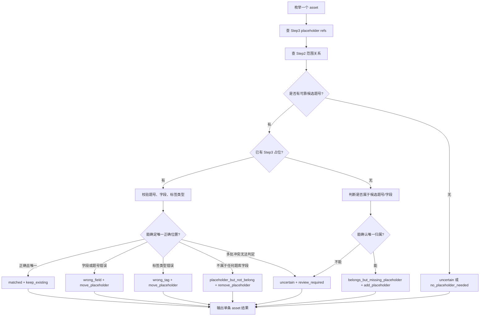

# Step4 视觉资产占位对账算法设计

来源：Step4 视觉资产占位对账设计。

目标：遍历所有图片、表格、图表资产，核对 Step3 已输出的占位标签，并只处理边界情况：

- 资产属于某个 Step3 字段，但 Step3 未放占位。
- 资产不属于某个 Step3 字段，但 Step3 已放占位。
- 资产在 Step3 多处出现，但实际只能保留一个最终归属。

## 基本结论

Step4 可以完成所有图片、表格、图表的遍历，但前提是“遍历”由本地代码完成，而不是交给模型发现。

本地代码必须从所有 Step2/raw page blocks 中枚举资产：

```text
kind in image|table|chart
```

每个资产必须进入 Step4 输入 `assets[]`。模型只负责对每个已枚举资产做占位对账。输出校验必须保证：

```text
输入 assets 数量 = 输出 assets 数量
每个输入 asset label 在输出中出现且只出现一次
```

如果某张图片没有进入 `assets[]`，Step4 prompt 无法补救。因此完整遍历是上游枚举和本地校验职责，不是模型职责。

## 唯一归属原则

没有“一图多归属”。

每个资产只能有一个最终归属：

```text
一个 label -> 一个 question_no -> 一个 target_field -> 一个 placeholder
```

如果同一个资产在 Step3 多个题号、多个字段或多个选项中出现，这不是一图多归属，而是重复占位或误放占位。Step4 必须选择唯一正确最终位置；同步阶段根据 Step3 占位索引删除其他位置。

无法安全选择唯一位置时，不得拆成多个归属，必须输出：

```text
placeholder_status = uncertain
action = review_required
target_field = none
insert_position = none
```

## 输入索引

Step4 运行前应构建四类索引。

### 1. 资产索引

从所有页面 block 枚举：

```json
{
  "label": "Q-V02-P01",
  "kind": "image|table|chart",
  "page": 2,
  "bbox": [0, 0, 0, 0],
  "source_part": "paper|answer|mixed"
}
```

### 2. Step2 范围索引

来自 Step2 `question_ranges`：

```json
{
  "question_no": 12,
  "start_label": "Q-V02-B01",
  "end_label": "Q-V02-B08",
  "visual_labels": ["Q-V02-P01"]
}
```

### 3. Step3 占位索引

扫描所有 Step3 records 的字段：

```text
stem_latex
options_latex[].options[].content_latex
answer_latex
analysis_latex
```

提取这些占位：

```text

<table src="...">
<chart src="...">
```

生成引用：

```json
{
  "asset_label": "Q-V02-P01",
  "question_no": 12,
  "field": "stem_latex",
  "option_group_no": "",
  "option_label": "",
  "placeholder": "",
  "array_index": 3
}
```

同一个 `asset_label` 可以在索引中出现多个引用，但 Step4 输出只能选择一个最终归属。其他引用由同步阶段删除。

### 4. 候选题号索引

对每个 asset 生成候选来源：

```text
in_range：asset label 位于 start_label/end_label 连续范围内
visual_label：asset label 出现在 Step2 visual_labels 中
outside_nearest：asset 不在范围内，但根据页码、阅读顺序、图题/表题、邻近题号生成候选
orphan：没有可靠候选
```

优先级：

```text
visual_label > in_range > outside_nearest > orphan
```

`orphan` 不得自动归属，只能输出 `review_required` 或 `ignore_asset`。

## 每个资产的处理流程



## 图片不在 Step2 范围内

如果图片不在 `start_label/end_label` 内，但可确认属于某个字段，则不要扩大 Step2 范围。

处理规则：

```text
step2_relation = visual_label 或 outside_nearest
placeholder_status = belongs_but_missing_placeholder
action = add_placeholder
```

插入位置：

```text
target_field=stem_latex      -> insert_position=append_to_field_end，追加到 stem_latex 数组最后
target_field=answer_latex    -> insert_position=append_to_field_end，追加到 answer_latex 数组最后
target_field=analysis_latex  -> insert_position=append_to_field_end，追加到 analysis_latex 数组最后
target_field=options_latex   -> insert_position=append_to_option_end，追加到对应 option 的 content_latex 数组最后
```

`options_latex` 特殊约束：

- 必须能确认 `option_group_no` 和 `option_label`。
- 如果只能确认是选项图，但不能确认哪个选项，不得自动插入，输出 `review_required`。

## 图片在 Step3 占位中但不属于该处

如果 Step3 已有占位，但从标注图、Step2 范围、图题/表题、附近文本判断不属于该处：

```text
placeholder_status = placeholder_but_not_belong
action = remove_placeholder
target_field = none
insert_position = remove_existing
```

如果该图片不属于当前字段，但属于另一个字段或另一个题号：

```text
placeholder_status = wrong_field
action = move_placeholder
source_field = 当前字段
target_field = 正确字段
```

移动等价于：

```text
从所有错误位置删除原 placeholder
向唯一 target_field 追加正确 placeholder
```

如果移动目标对应的 `step2_relation` 为 `visual_label` 或 `outside_nearest`，则插入位置按范围外规则追加到字段末尾。

## 多处已有占位的处理

如果同一个资产在 Step3 中出现多个 `step3_placeholder_refs`：

1. 判断是否存在唯一正确引用。
2. 如果存在，输出该唯一目标。
3. 同步阶段删除同一 asset label 的其他引用。
4. 如果无法判断唯一正确引用，输出 `uncertain + review_required`。

不得输出多个归属，不得使用 `placements[]`。

## 状态定义

```text
matched：Step3 已有唯一正确占位，题号、字段、标签类型均正确。
belongs_but_missing_placeholder：资产应属于某题某字段，但 Step3 没有正确占位。
placeholder_but_not_belong：Step3 有占位，但资产不属于该题或该字段。
wrong_field：资产属于同一题或另一题，但 Step3 放错字段。
wrong_tag：资产归属正确，但 /<table>/<chart> 标签类型错误。
no_placeholder_needed：资产是噪声、装饰、二维码、水印，或无需进入题库正文。
uncertain：无法安全判断唯一最终归属。
```

## 动作定义

```text
keep_existing：保留唯一正确 Step3 已有占位，并删除同一 label 的其他重复占位。
add_placeholder：新增占位。
remove_placeholder：删除已有占位。
move_placeholder：删除旧位置，占位追加到唯一新位置。
ignore_asset：忽略资产，不进入题库正文。
review_required：人工复核。
```

## 本地校验

Step4 输出后必须执行本地校验：

- 每个输入 asset 输出一次。
- 每个输入 asset label 在输出中出现且只出现一次。
- 不允许输出 `placements[]`。
- 除 `ignore_asset` 和 `review_required` 外，`question_no` 必须来自候选题号。
- `target_field` 必须是 `stem_latex`、`options_latex`、`answer_latex`、`analysis_latex` 或 `none`。
- `placeholder` 的 `src` 必须等于资产 label。
- `target_field=options_latex` 时必须有 `option_group_no` 和 `option_label`。
- `append_to_field_end` 只能用于 `stem_latex`、`answer_latex`、`analysis_latex`。
- `append_to_option_end` 只能用于 `options_latex`，且必须指定 `option_group_no` 和 `option_label`。
- `orphan` 不得自动 `add_placeholder` 或 `move_placeholder`。
- 同一 `asset_label` 在 Step3 多处出现时，同步阶段必须删除非最终目标位置。

## 同步阶段

同步阶段根据 Step4 单条 asset 结果修改 Step3 records：

```text
keep_existing：
  保留最终目标位置，删除同一 label 的其他重复占位。

add_placeholder：
  向 target_field 末尾追加 placeholder。

move_placeholder：
  删除所有旧位置的同一 label 占位。
  向 target_field 末尾追加 placeholder。

remove_placeholder：
  删除所有旧位置的同一 label 占位。

ignore_asset：
  不改 Step3 正文。

review_required：
  不自动改 Step3 正文，只记录风险。
```
