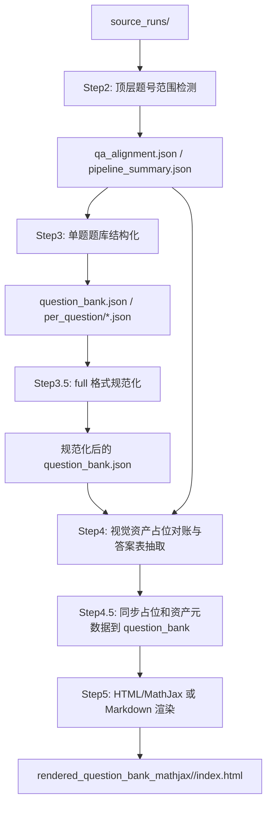

# Step2-Step5 处理方式与流转设计

来源：现有 v11 runtime 脚本与 prompt 外置化重构设计。

目标：记录原先各步骤的处理方式、数据流转、失败边界和当前重构后的接口方向。本文是流程契约文档，不是运行日志，不保存任何一次模型返回或真实图片内容。

## 总体流转



基本顺序：

```text
Step2 -> Step3 -> Step3.5 -> Step4 -> Step4.5 sync -> Step5
```

关键原则：

- Step2 只切顶层题号范围，不做题库正文结构化。
- Step3 负责从题面图和答案/解析图整理单题题库字段。
- Step3.5 只做全量格式规范化，不补内容、不解题、不重新归类。
- Step4 不重写正文，只做 Step3 资产占位对账和答案表格抽取。
- Step5 不调用大模型，只读取最终题库和资产生成审阅页面。

## Step2：顶层题号范围检测

来源代码：`step2_layout.py`

### 输入

来自 source run 的页面标注图和 OCR blocks：

```text
source_runs/<run_id>/{paper,answer,mixed}/...
```

模型输入包含：

- 标注页图片。
- 页面 blocks 的 label、kind、text、bbox。
- `range_mode`：`pure_paper`、`pure_answer`、`mixed`。

### 处理方式

Step2 对每个页面或页面组调用 VLM，只做顶层题号范围检测：

- 找到每个顶层题号。
- 输出该题的 `start_label` 和 `end_label`。
- 对明显属于某题但不在连续范围内的图片、表格、图表，只放入 `visual_labels`。
- 不解题，不修改 OCR，不判断题型，不把图片归入正文字段。

范围可重叠：

- 同一 OCR block 同时包含上一题尾部和下一题开头时，相邻题可共用边界。
- 答案页紧凑答案键中多个题号可复用同一 block。

### 输出

Step2 模型输出：

```text
question_ranges
noise_blocks
risks
```

本地代码进一步生成：

```text
runs_step2_exam_blocks/<run_id>_raw_units/qa_alignment.json
runs_step2_exam_blocks/<run_id>_raw_units/pipeline_summary.json
```

其中 `qa_alignment.json` 是下游唯一主链路表，必须适配 `pure_paper`、`mixed`、`paper_plus_answer`、后导入 `answer` 四种模式。

四模式契约见：

```text
step2_qa_alignment_contract.md
```

### 流向 Step3

Step3 不直接重新扫描整页，而是读取 Step2 产物：

```text
qa_alignment[].question_no
qa_alignment[].question.labels
qa_alignment[].question.core_labels
qa_alignment[].question.surface_labels
qa_alignment[].question.visual_labels
qa_alignment[].answer.status
qa_alignment[].answer.items
```

这些数据决定每道题的题面裁剪图、答案/解析裁剪图和来源标签。

裁剪图生成规则见：

```text
step2_crop_algorithm.md
```

其中同页跨栏题目不得直接对全页 labels 做单个 union bbox，应先拆成多个 crop island 后分别裁图，避免把两栏之间的无关区域裁入 Step3 输入。

### 失败边界

- `question_ranges` 为空时失败。
- 缺少 `qa_alignment.json` 时 Step3 preflight 失败。
- 缺少某题 Step2 range labels 时 Step3 失败。

## Step3：单题题库结构化

来源代码：`step3_question_json.py`

### 输入

Step3 以“每道题”为单位构造 payload：

```text
Step2 qa_alignment
Step2 question range labels
题面裁剪图
答案/解析裁剪图
可选 OCR 文本和资产标签
```

当前 prompt 重构目标为 image-only 主流程：

```text
题面裁剪图 + 答案/解析裁剪图 -> image_only_question_standardization_v1
```

### 处理方式

Step3 调用 VLM 做单题整理：

- 从题面图整理 `stem_markdown`。
- 从题面图整理 `options_markdown`。
- 从答案/解析图整理 `answer_markdown`。
- 从答案/解析图整理 `analysis_markdown`。
- 记录 `issues`。
- 在对应字段中放置资产占位：``、`<table src="...">`、`<chart src="...">`。

Step3 不应做：

- 不解题。
- 不根据解析反推答案。
- 不补图片中没有出现的内容。
- 不把题号写入 `stem_markdown`。
- 不保留旧 `question_type` 作为必要字段。

### 输出

重构目标输出字段：

```json
{
  "schema_version": "image_only_question_standardization_v1",
  "question_no": 1,
  "stem_markdown": [],
  "options_markdown": [],
  "answer_markdown": [],
  "analysis_markdown": [],
  "issues": []
}
```

本地写入：

```text
runs_question_bank/<run_id>/per_question/qXX.json
runs_question_bank/<run_id>/question_bank.json
runs_question_bank/<run_id>/question_bank.jsonl
runs_question_bank/<run_id>/summary.json
```

### 流向 Step3.5

Step3.5 读取 `question_bank.json` 或 per-question records，对每道题做全量格式规范化。

### 流向 Step4

Step4 读取 Step3 records 中的资产占位，构建 `step3_placeholder_refs`。Step4 不重新生成题干正文，只校验占位是否与版面资产一致。

### 失败边界

- 某题缺少 Step2 裁剪图时失败。
- 模型未按强制 tool call 返回时失败。
- 工具参数无法通过 schema 校验时失败。
- 题号不匹配时失败。

## Step3.5：full 格式规范化

来源代码：`step35_normalize.py`

### 输入

```text
runs_question_bank/<run_id>/question_bank.json
本地 audit_findings
```

`audit_findings` 只是提示，不是修复范围上限。

### 处理方式

Step3.5 对每道题做 full normalize：

- 即使 `audit_findings` 为空，也完整审计所有文字字段。
- 规范 LaTeX 包裹、HTML 实体、`\left/\right`、`<blank>`、`<choice_blank>`。
- 保持题意、答案、解析和可见文字语义不变。
- 保持字段结构与 Step3 schema 一致。

处理对象：

```text
stem_markdown
options_markdown[].options[].content_markdown
answer_markdown
analysis_markdown
issues
```

### 输出

```text
reviews_step3_5_latex_audit/<run_id>/normalized_question_bank.json
reviews_step3_5_latex_audit/<run_id>/merged_question_bank.json
reviews_step3_5_latex_audit/<run_id>/summary.json
```

如果启用 write-back：

```text
runs_question_bank/<run_id>/question_bank.json
runs_question_bank/<run_id>/question_bank.before_step3_5_latex_audit.json
```

### 合并规则

本地代码必须保留保护门：

- schema 校验。
- `question_no` 不变。
- before/after audit。
- 内容指纹保护。
- 只应用允许字段。

### 流向 Step4

Step4 应读取 Step3.5 后的最终 `question_bank.json`，以规范化后的资产占位为准。

## Step4：视觉资产占位对账和答案表格抽取

来源代码：`step4_runtime.py`、`step4_assets.py`、`step45_sync.py`

详细算法见：

```text
step4_asset_placeholder_algorithm.md
```

### 输入

Step4 同时读取：

```text
Step2 qa_alignment
Step3.5 后 question_bank.json
所有 raw page blocks 中的 image|table|chart
答案页表格 OCR HTML
```

Step4 只允许从 `qa_alignment.json` 读取资产候选题号、题面范围、答案状态和 visual labels。

不再设计独立题面分组文件；如果资产候选需要调整，应回到 Step2 更新 `qa_alignment.json` 后重跑。

### 处理方式

视觉资产部分：

- 本地代码必须全量枚举所有图片、表格、图表到 `assets[]`。
- 模型只对已枚举资产做占位对账。
- 每个资产只能有一个最终归属。
- 范围外但可确认属于某字段的资产，不扩大 Step2 范围，追加到目标字段末尾。
- Step3 多处出现同一 asset label 时，选择唯一最终位置，其他位置删除。

答案表格部分：

- 只识别答案速查表。
- 只有最终答案表可生成 `answer_markdown` 条目。
- 解析表、评分表、过程表不得抽取最终答案。

### 输出

```text
runs_step2_exam_blocks/<run_id>_raw_units/visual_asset_assignment.json
runs_step2_exam_blocks/<run_id>_raw_units/answer_table_extraction.json
runs_step2_exam_blocks/<run_id>_raw_units/step4_question_bank_sync.json
```

### Step4.5 同步

同步阶段把 Step4 结果写回 question bank：

- 新增缺失占位。
- 删除误放占位。
- 移动错字段占位。
- 写入资产元数据。
- 不重写题干、答案或解析正文。

同步后 Step5 才能渲染最终资产位置。

## Step5：题库渲染

来源代码：`step5_vlm_html_mathjax_render.py`

### 输入

```text
runs_question_bank/<run_id>/question_bank.json
runs_question_bank/<run_id>/summary.json
runs_step2_exam_blocks/<run_id>_raw_units/pipeline_summary.json
runs_step2_exam_blocks/<run_id>_raw_units/qa_alignment.json
source_runs/<run_id>/pages
rendered_question_bank_mathjax/<run_id>/assets
```

### 原先处理方式

原先 Step5 是审阅渲染器：

- 不调用大模型。
- 读取旧版 `*_latex` 字段。
- 手写文本切分和占位替换。
- 浏览器端用 MathJax 渲染 `$...$` 和 `$$...$$`。
- 同步并显示 Step2 裁剪图和资产图片。

### 重构方向

前序步骤已改为 Markdown 字段后，Step5 应改为：

- 读取 `stem_markdown`、`options_markdown`、`answer_markdown`、`analysis_markdown`。
- 使用开源 Markdown parser 解析 Markdown。
- 用受控 adapter 渲染 `<blank>`、`<choice_blank>`、``、`<table src>`、`<chart src>`。
- 继续用 MathJax 渲染数学。
- 不修复 LaTeX，不移动资产，不修改 question bank。

### 输出

```text
rendered_question_bank_mathjax/<run_id>/index.html
rendered_question_bank_mathjax/index.html
rendered_question_bank_mathjax/<run_id>/assets/...
```

### 失败边界

- 缺少 `question_bank.json` 时失败。
- 资产文件缺失时显示 missing asset，但不修改题库。
- Markdown/HTML 渲染层不得吞掉非法占位；非法占位应在审阅页暴露。

## 端到端证据

每次完整流程结束后，最终报告至少包含：

```text
Step2 question_count / answered_question_count
Step3 success_count / error_count / issue_counts
Step3.5 question_count / normalized_count / error_count / before_finding_count
Step4 asset_count / assigned_or_checked_count / risk_count / sync_changed_question_count
Step5 render entry path
```

失败不应通过手工修改最终 JSON 掩盖。应修脚本顺序、prompt、schema 或输入结构后重跑。
