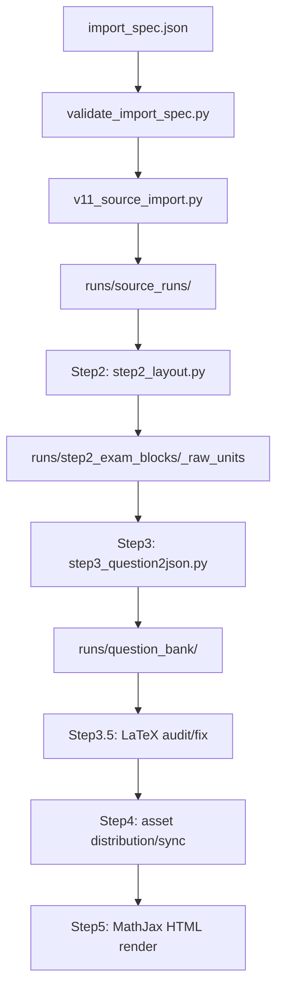

# exam-import Skill 功能说明书与实现 SPEC

版本对象：当前本地 `skills/exam-import` 目录  
更新时间：2026-06-01  
适用范围：数学试卷 PDF/OCR 到 v11 题库 JSON、资产分配、MathJax HTML 审核页的可复现导入流程

## 1. 目标

`exam-import` 是一个用于标准化数学试卷导入的本地 Skill。它的核心目标不是临时修某一道题，而是把一次导入变成可复现、可审计的 pipeline run。

该 Skill 应支持：

- 将用户需求整理成明确的导入规格 `import_spec`。
- 校验输入文件、页码范围、模型、TPM、缓存策略和步骤开关。
- 调用内置 v11 runtime 完成源文件抽取、Step2 切题、Step3 题库 JSON 标准化、Step3.5 LaTeX 审计、Step4 图片资产归属、Step5 MathJax 渲染。
- 对支持 `json_schema` 的模型使用结构化 JSON Schema 输出。
- 对不支持 `json_schema` 但支持 tool calling 的模型，使用强制 tool call 输出 Step3 JSON。
- 支持 Step3 在不输入 OCR 文本时，仅基于 Step2 裁剪图片进行 image-only 标准化测试。
- 每次完整运行后报告真实证据：成功数、错误数、Step2 题量、答案缺失、Step3 summary、审计结果、资产数量、同步数量、渲染入口。

该 Skill 明确不应做：

- 手工改最终 JSON 来掩盖流程问题。
- 为了“流程不断”增加静默 fallback。
- 在没有必要说明和审核的情况下引入大范围后处理纠错。
- 把历史实验缓存、旧脚本或无关产物混入新的导入流程。

## 2. 目录结构

```text
skills/exam-import/
  SKILL.md
  FUNCTIONAL_SPEC.zh-CN.md
  agents/
    openai.yaml
  assets/
    import_spec.template.json
    v11_runtime/
      run_pipeline.py
      run_answer_patch.py
      step2_layout.py
      step3_question2json.py
      step3_schema.py
      step3_5_question_json_audit_fix.py
      step4_asset_distribution.py
      step5_vlm_html_mathjax_render.py
      common_*.py
      question_bank_app.py
      exam_agent_pipeline.py
      requirements.txt
  references/
    import-spec.md
    v11-runtime.md
  scripts/
    validate_import_spec.py
    v11_source_import.py
```

说明：

- `SKILL.md` 是 Codex 调用该 Skill 的操作约束。
- `assets/v11_runtime/` 是当前 Skill 自带的可运行 v11 pipeline，实现与 GitHub 源码不一定一致。
- `scripts/validate_import_spec.py` 用于把导入规格校验成可执行命令。
- `scripts/v11_source_import.py` 用于把 PDF 源文件抽取成 v11 `source_runs` 布局。
- `references/` 是执行前查阅的简版规范。

## 3. 输入规格

导入入口应先形成一个 JSON spec，模板为：

```json
{
  "run_id": "",
  "input_mode": "paper_plus_answer_file",
  "v11_root": "",
  "runs_root": "",
  "sources": {
    "paper_pdf": "",
    "paper_page_range": "",
    "answer_pdf": "",
    "answer_page_range": "",
    "mixed_pdf": ""
  },
  "source_rules": {
    "paper": "",
    "answer": ""
  },
  "llm": {
    "provider": "siliconflow",
    "primary_model": "Qwen/Qwen3.6-27B",
    "worker_models": [],
    "model_tpm_limits": {},
    "tpm_limit": 0,
    "token_estimator_model": "",
    "tpm_output_reserve": 2048,
    "token_budget_pool": "",
    "token_budget_log": "",
    "token_budget_verbose": false,
    "image_token_mode": "auto",
    "timeout": 180,
    "step3_timeout": null,
    "step3_5_timeout": null,
    "asset_timeout": null,
    "max_workers": 8,
    "enable_thinking": false
  },
  "mineru": {
    "token_file": "",
    "timeout": 900,
    "poll_interval": 10,
    "extract_retries": 3,
    "extract_retry_sleep": 60,
    "dpi": 144
  },
  "cache_policy": {
    "reuse_existing_ocr": false,
    "force_source": false,
    "force_pipeline": true
  },
  "steps": {
    "skip_step2": false,
    "skip_step3": false,
    "step3_5": true,
    "skip_step4": false,
    "skip_render": false
  },
  "expected": {
    "question_count": 0,
    "notes": ""
  }
}
```

### 3.1 input_mode

- `pure_paper`：只有试卷题面。要求 `sources.paper_pdf`。
- `paper_plus_answer_file`：题面和答案解析是两个逻辑部分。要求 `sources.paper_pdf` 和 `sources.answer_pdf`。同一个 PDF 可通过页码范围拆分。
- `mixed`：题面、答案、解析混在同一逻辑文档。要求 `sources.mixed_pdf` 或 `sources.paper_pdf`。
- `answer_patch_for_existing_pure_paper`：给已有纯题面 run 补答案。要求已有题面 OCR 与 Step2 纯题面切分结果。

### 3.2 run_id

`run_id` 必须是稳定 ASCII 标识，只允许字母、数字、下划线、点和横线。它会决定所有产物目录。

### 3.3 模型与 TPM

支持的 provider：

- `siliconflow`
- `bailian`
- `bailian_batch`
- `env`

环境变量：

- `LLM_ENDPOINT`
- `LLM_API_KEY`

本地 token 文件：

- SiliconFlow：`.siliconflow_token` 或 `.silliconflow_token`
- 百炼：`.bailian_token`

TPM 控制：

- `tpm_limit` 是单模型总限流。
- `model_tpm_limits` 是按模型分桶的限流配置。
- 多 worker model 时，每个请求模型都必须配置 TPM bucket，否则应失败。
- `token_budget_pool` 可用 SQLite 文件在多进程之间共享 TPM 预算。

配置边界：

- provider config 只描述厂商接入规则，例如 endpoint、base URL、token 来源、thinking 参数形式、是否支持 `json_schema`、tool calling 或 batch endpoint。
- model config 只描述模型静态能力，例如模型名、provider、token estimator、上下文窗口、建议 TPM、默认 thinking 策略、已验证结构化输出能力。
- call spec 描述某一次 Step 调用如何执行，例如 Step3 标准 OCR、Step3 image-only、Step3.5 审计、Step4 资产归属分别使用哪个 model、structured output、tool schema、temperature、timeout、是否传 OCR、是否传图片。
- 每一次 LLM 调用都应在调用时读取一个显式 `call_spec.json`；不要在 Python 代码中硬编码或隐式选择调用 profile。
- import spec 和 CLI 可以生成或指定 `call_spec.json` 路径，但最终应先读取并校验 call spec，再发起请求。
- provider config 不应保存单次调用参数；model config 不应保存 API key；call spec 不应保存 endpoint 和 token。

建议的 `call_spec.json` 最小结构：

```json
{
  "schema_version": "call_spec_v1",
  "step": "step3",
  "mode": "standard_ocr",
  "prompt": "prompts/zh_CN/step3_question_json.md#standard_ocr",
  "provider": "siliconflow",
  "model": "Qwen/Qwen3.6-27B",
  "structured_output": "tool_calling",
  "tool_name": "submit_step3_record",
  "tool_schema": "Step3Record",
  "temperature": 0.1,
  "top_p": 0.8,
  "timeout": 180,
  "enable_thinking": false,
  "input": {
    "ocr": true,
    "images": true
  }
}
```

## 4. 总体数据流



## 5. 源文件抽取

脚本：`scripts/v11_source_import.py`

职责：

- 接收源文档路径、页码范围、输入模式和 MinerU 配置。源文档当前主要是 PDF；Word/Docx 可通过 MinerU 抽取接入。
- 生成 v11 source run 布局。
- 对题面和答案分别抽取 OCR。

目标产物：

```text
runs/source_runs/<run_id>/
  source_item.json
  paper/ocr_blocks.json
  answer/ocr_blocks.json
```

`mixed` 模式只使用 `paper/ocr_blocks.json`。

缓存策略：

- `reuse_existing_ocr=false` 时，不应无提示复用旧 OCR。
- `force_source=true` 时，应强制重新抽取源。
- OCR 缺失或目录不完整时应失败，而不是静默跳过。

Word/非 PDF 页图规则：

- 2026-06-02 实测 MinerU 直传 `.docx` 会在结果包中返回 `*_origin.pdf`。
- 非 PDF 源文件不得生成空白 `pages/page_*.png` 占位图；Step2/Step3/Step4 需要真实页图用于标注、裁剪和 VLM 输入。
- `extract_document_mineru_vlm()` 对非 PDF 应优先使用 MinerU 解压目录中的 `*_origin.pdf`、`origin.pdf`、`*layout*.pdf` 或 `layout.pdf` 渲染 `pages/page_*.png`。
- 如果 MinerU 非 PDF 结果包中没有可渲染 PDF，应立即失败，不应继续跑后续步骤。

## 6. Step2：版面切分

脚本：`assets/v11_runtime/step2_layout.py`

职责：

- 读取 `source_runs/<run_id>` 下的 OCR blocks。
- 根据输入模式切分题目范围、答案范围。
- 建立题号到 OCR block label 的映射。
- 生成题面和答案侧的范围文件、对齐结果和 pipeline summary。
- 为后续 Step3 裁剪图片提供 labels。

主要参数：

```powershell
python.exe step2_layout.py `
  --source-runs-root <runs>/source_runs `
  --output-root <runs>/step2_exam_blocks `
  --run-id <run_id> `
  --mode <auto|pure_paper|paper_plus_answer_file|mixed> `
  --model <model> `
  --worker-model <model> `
  --llm-provider <siliconflow|bailian|env> `
  --timeout <seconds> `
  --tpm-limit <n> `
  --max-workers <n> `
  --force
```

核心产物：

```text
runs/step2_exam_blocks/<run_id>_raw_units/
  pipeline_summary.json
  step2_*_ranges.json
  *_label_index.json
```

`pipeline_summary.json` 至少应关注：

- `question_count`
- `answered_question_count`
- `missing_answer_numbers`
- `mode`
- `visual_asset_assignment_summary`
- `asset_match_risk_count`

## 7. Step3：题库 JSON 标准化

脚本：`assets/v11_runtime/step3_question2json.py`

职责：

- 将 Step2 的题目范围和答案范围整理为一题一个结构化 JSON。
- 同时向模型提供 OCR 文本和 Step2 裁剪图。
- 支持 JSON Schema 和 tool calling 两种结构化输出方式。
- 输出 per-question 原始响应、校验响应、最终记录和总 summary。

### 7.1 输出 schema

Step3 标准记录固定为：

```json
{
  "schema_version": "step3_json_schema_v1",
  "question_no": 1,
  "question_type": "fill_blank",
  "stem_latex": [],
  "options_latex": {
    "A": [],
    "B": [],
    "C": [],
    "D": []
  },
  "answer_latex": [],
  "analysis_latex": [],
  "rubric_latex": [],
  "issues": []
}
```

约束：

- `question_type` 只能是 `fill_blank`、`single_choice`、`multiple_choice`、`solution`、`unknown`。
- `options_latex` 必须包含 A/B/C/D 四个键。
- `issues[].severity` 只能是 `info`、`warning`、`error`。
- 所有数组项必须是单行非空字符串。
- 额外字段禁止出现。

### 7.2 输入给模型的 payload

默认 OCR 模式下，发送给模型的是极简 payload：

- `question_no`
- `mode`
- `boundary_hint`
- `question_ocr`
- `answer_ocr`
- 或 mixed 模式下的 `ocr_text`

模型同时接收 Step2 裁剪图：

- 题面裁剪图来自 `step2_question_range_labels`
- 答案/解析裁剪图来自 `source_answer_labels`

### 7.3 image-only no OCR 模式

新增参数：

```powershell
--no-ocr-input
```

开启后，模型 payload 不包含 `question_ocr`、`answer_ocr` 或 `ocr_text`，只包含：

```json
{
  "question_no": 5,
  "mode": "paper_plus_answer_file",
  "boundary_hint": "只整理第5题。不要依赖 OCR 文本；题面和答案解析均以图片为准。",
  "input_mode": "image_only_no_ocr"
}
```

此时模型主要依赖：

- Step2 题面裁剪图
- Step2 答案/解析裁剪图
- 题号和边界提示

用途：

- 测试 VLM 在无 OCR 输入下能否直接从图片生成题库 JSON。
- 判断 OCR 文本对内容缺失、公式缺失、答案缺失的影响。

风险：

- 对图片阅读能力要求高。
- 输出稳定性低于带 OCR 模式。
- 单题可能出现 LaTeX 分隔符缺失、答案字段为空、解析不完整等非结构性错误。

### 7.4 JSON Schema 模式

参数：

```powershell
--structured-output json_schema
```

实现：

- 请求体使用 `response_format.type=json_schema`。
- schema 使用 Pydantic `Step3Record` 生成的 JSON Schema。
- 响应必须是一个 JSON object。

适用：

- 支持 OpenAI compatible JSON Schema 的模型或平台。

已知问题：

- 部分模型即使支持 `json_object`，也不代表能严格遵守 schema。
- 部分平台或模型不支持 `json_schema`。

### 7.5 Tool Calling 模式

参数：

```powershell
--structured-output tool_calling
```

实现：

- 请求体中传入 `tools`。
- 定义函数：

```json
{
  "name": "submit_step3_record",
  "description": "提交整理后的单题题库 JSON 记录。",
  "parameters": {
    "type": "object",
    "required": [
      "schema_version",
      "question_no",
      "question_type",
      "stem_latex",
      "options_latex",
      "answer_latex",
      "analysis_latex",
      "rubric_latex",
      "issues"
    ]
  }
}
```

- `tool_choice` 强制为：

```json
{
  "type": "function",
  "function": {
    "name": "submit_step3_record"
  }
}
```

- 程序读取 `choices[0].message.tool_calls[0].function.arguments` 作为 JSON 字符串。
- 若模型未返回 tool call，应立即失败。

设计原因：

- 很多模型不支持 `json_schema`，但支持 tool calling。
- tool calling 比普通 `json_object` 更容易把输出限制到函数参数结构。
- 实测中，普通 `json_object` 可能 JSON 可解析但字段类型、枚举值或 schema 不合规。

注意：

- 百炼 Qwen3.6 系列在 tool calling 下需要关闭 thinking；`enable_thinking=true` 可能导致 tool choice 不兼容。
- 当前 prompt 明确含 `/no_think`，CLI 默认 `--no-enable-thinking`。
- 火山方舟 Ark Chat API 的深度思考开关使用 `thinking: {"type": "disabled"}`。本地运行可设置环境变量 `LLM_THINKING_TYPE=disabled`，`common_llm.py` 会在请求体中写入该字段并移除兼容模式的 `enable_thinking` 字段。
- 2026-06-02 对照测试：`doubao-seed-2-0-lite-260215` 在 `thinking: {"type": "disabled"}` 下可正常返回 `message.tool_calls`；`doubao-seed-2-0-code-preview-260215` 的最小 tool-call 请求返回 `finish_reason="tool_calls"` 但 `message.tool_calls` 缺失，不能作为 Step2/Step3/Step4 流程成功证据，应记录为模型/API 返回兼容问题并失败暴露。

图片占位符规则：

- 2026-06-02 起，Step3 遇到 `<imagexx>`、`<chartxx>`、`<figurexx>` 临时占位符时，不再把临时占位符原样写入题库 JSON，而是根据 `non_text_placeholders` 中的 `label` 写入图片标号，例如 `Q-V02-P01`、`A-V03-P01` 或 `M-V01-P01`。
- 纯图片选项的 `options_latex.A/B/C/D` 应写图片标号数组，例如 `["Q-V02-P01"]`，而不是空数组或 `<image01>`。
- Step5 渲染支持把字段中的图片标号替换成对应图片；若 `visual_assets` 或 `option_asset_placeholders` 中有同名资产，不应把图片标号作为普通文本显示。
- mixed 试卷的 Step2 初始视觉标签统一使用 `M-Vxx-Pxx` / `M-Vxx-Bxx`，不再先标为 Q/A。Step4 负责在后续资产归属中判定题干图、答案图、解析图或选项图角色。

### 7.6 Step3 CLI

单独运行 Step3：

```powershell
python.exe skills\exam-import\assets\v11_runtime\step3_question2json.py `
  --run-id <run_id> `
  --runs-root <runs>\step2_exam_blocks `
  --output-root <runs>\question_bank `
  --model <model> `
  --structured-output <json_schema|tool_calling> `
  --question-no 5 `
  --max-workers 1 `
  --tpm-limit 58000 `
  --token-estimator-model <model> `
  --no-enable-thinking `
  --force
```

image-only：

```powershell
python.exe skills\exam-import\assets\v11_runtime\step3_question2json.py `
  --run-id <run_id> `
  --runs-root <runs>\step2_exam_blocks `
  --output-root <runs>\question_bank_image_only `
  --model Qwen/Qwen3.6-35B-A3B `
  --structured-output tool_calling `
  --no-ocr-input `
  --question-no 5 `
  --max-workers 1 `
  --tpm-limit 58000 `
  --token-estimator-model Qwen/Qwen3.6-27B `
  --no-enable-thinking `
  --force
```

百炼 File Batch 批量推理：

- `run_bailian_file_batch_steps.py` 用百炼 OpenAI-compatible File Batch API 跑 Step3、Step3.5、Step4。
- 批量粒度是“一个 Step 一个 JSONL 文件、一次提交该 Step 的全部请求”，不是逐题逐页实时调用。
- 默认模型可用 `qwen3.6-flash`；tool calling 请求必须关闭 thinking，runner 写入 `enable_thinking=false`。
- runner 支持 `--steps step3,step35,step4` 选择子步骤。
- 若轮询或下载阶段遇到网络断开，不应重复提交同一个 Step；应使用 `--resume-step3-batch-id`、`--resume-step35-batch-id` 或 `--resume-step4-batch-id` 继续处理已创建 batch。
- Step4 batch 输出解析后必须调用 `apply_visual_asset_assignment_to_rows` 应用回 `qa_alignment`，再同步到 question_bank；否则渲染阶段拿不到 `visual_assets` 和 `option_asset_placeholders`。

### 7.7 Step3 产物

```text
runs/question_bank/<run_id>/
  question_bank.json
  question_bank.jsonl
  summary.json
  per_question/
    q05_input.json
    q05_source_payload.json
    q05_raw.json.txt
    q05_validated.json
    q05.json
    step3_question_crops/
    step3_answer_crops/
```

summary 字段：

- `question_count`
- `success_count`
- `error_count`
- `question_type_counts`
- `issue_counts`
- `severity_counts`
- `total_elapsed_seconds`
- `created_at`
- `model`
- `standardizer`
- `results`

### 7.8 Step3 当前审计边界

当前 Step3 会做：

- Pydantic schema 校验。
- 题号不一致修正并记录 issue。
- 空字段检查。
- 选项字段规范化。
- 填空 `<blank>` 规范化。
- 图片/表格 placeholder 清理。
- 部分独立数学答案自动包 `$...$`。
- 内容警告，如题干/答案/解析疑似缺失。

当前 Step3 不足：

- 不能稳定发现混排文本中数学表达式未包 `$...$` 的问题。
- 不能保证模型不会漏掉 OCR 或图片中的局部公式。
- `status=ok` 只代表结构和当前规则通过，不代表内容一定完整。

已观察到的风险例子：

- Q19：某次带 OCR 的模型输出漏掉题干公式，但 schema 仍通过。
- Q5：某次 image-only 输出题干和解析中数学表达式未包 `$...$`，重跑两次未复现，说明是模型输出不稳定而非必然 bug。
- Q17：某次 image-only 输出 `answer_latex` 为空。

## 8. Step3.5：LaTeX 审计与修复

脚本：`assets/v11_runtime/step3_5_question_json_audit_fix.py`

职责：

- 对 Step3 输出进行 LaTeX 包裹和字段格式审计。
- 可选择调用 LLM 修复被标记的问题。
- 可 dry-run。
- 可 write-back 到 question bank。

主要参数：

```powershell
python.exe step3_5_question_json_audit_fix.py `
  --run-id <run_id> `
  --qb-root <runs>\question_bank `
  --output-root <runs>\reviews_step3_5_latex_audit `
  --model <model> `
  --source-stage <validated|question_bank> `
  --fields <question_surface|all|field1,field2> `
  --question-no 5 `
  --dry-run `
  --write-back
```

产物：

```text
runs/reviews_step3_5_latex_audit/<run_id>/
  summary.json
```

当前定位：

- Step3.5 是审核和修复层，不应替代 Step3 的 schema、prompt 或输入结构修复。
- 若发现规则缺口，应优先讨论是否扩大 Step3/Step3.5 审计规则，而不是手工改最终 JSON。

## 9. Step4：视觉资产归属与同步

脚本：`assets/v11_runtime/step4_asset_distribution.py`

职责：

- 根据 Step2/Step3 信息判断图片资产属于题干、选项、答案、解析或噪声。
- 抽取答案表格相关结构。
- 将 Step4 的资产归属同步回 question bank。

主要参数：

```powershell
python.exe step4_asset_distribution.py `
  --runs-root <runs>\step2_exam_blocks `
  --qb-root <runs>\question_bank `
  --run-id <run_id> `
  --model <model> `
  --worker-model <model> `
  --llm-provider <siliconflow|bailian|env> `
  --timeout <seconds> `
  --tpm-limit <n> `
  --force
```

产物和证据：

- `visual_asset_assignment_summary.asset_count`
- `assigned_count`
- `noise_count`
- `uncertain_count`
- `risk_count`
- `step4_question_bank_sync.json`
- `changed_question_count`

## 10. Step5：MathJax HTML 渲染

脚本：`assets/v11_runtime/step5_vlm_html_mathjax_render.py`

职责：

- 将 question bank JSON 渲染成浏览器审核页。
- 使用 MathJax 保留 TeX 数学表达。
- 同步图片资产到渲染目录。
- 显示 Step2 题面和答案裁剪图，便于人工对照。

主要参数：

```powershell
python.exe step5_vlm_html_mathjax_render.py `
  --run-id <run_id> `
  --qb-root <runs>\question_bank `
  --asset-root <runs>\question_bank `
  --block-root <runs>\step2_exam_blocks `
  --source-runs <runs>\source_runs `
  --output-root <runs>\rendered_question_bank_mathjax
```

产物：

```text
runs/rendered_question_bank_mathjax/
  index.html
  <run_id>/
    index.html
```

渲染器边界：

- 渲染器只渲染已存在的 `$...$` 或 `$$...$$` 数学片段。
- 如果 Step3 输出裸 `\frac`、`\sqrt`，渲染器不会自动把它们补成数学环境。
- 因此 LaTeX 分隔符缺失是 Step3/审计问题，不应归咎于 Step5。

## 11. run_pipeline 总控

脚本：`assets/v11_runtime/run_pipeline.py`

职责：

- 串联 Step2、Step3、Step3.5、Step4、Step5。
- 配置 provider 环境变量。
- 配置 TPM 限流和 token budget 日志。
- 支持多 worker model 分题并行。
- Step3 入口会在调用 `step3_question2json.py` 前预检 `runs_root/{run_id}_raw_units/qa_alignment.json`，并向子进程传递 resolve 后的绝对路径。若缺失，会报告实际检查的绝对路径和同一 `runs_root` 下附近的 `qa_alignment.json`，避免把入口路径问题误报成底层 Step3 错误。

主要参数：

```powershell
python.exe run_pipeline.py `
  --source-runs-root <runs>\source_runs `
  --runs-root <runs>\step2_exam_blocks `
  --qb-root <runs>\question_bank `
  --render-root <runs>\rendered_question_bank_mathjax `
  --step3-5-root <runs>\reviews_step3_5_latex_audit `
  --run-id <run_id> `
  --mode <auto|pure_paper|paper_plus_answer_file|mixed> `
  --model <primary_model> `
  --worker-model <worker_model> `
  --llm-provider <siliconflow|bailian|env> `
  --timeout <seconds> `
  --step3-timeout <seconds> `
  --step3-5-timeout <seconds> `
  --asset-timeout <seconds> `
  --max-workers <n> `
  --tpm-limit <n> `
  --model-tpm-limit MODEL=LIMIT `
  --token-budget-pool <pool.sqlite> `
  --token-estimator-model <model> `
  --force
```

步骤开关：

- `--skip-step2`
- `--skip-step3`
- `--step3-5` / `--no-step3-5`
- `--skip-step4`
- `--skip-render`

注意：

- 当前 `run_pipeline.py` 已暴露 Step2、Step3.5、Step4 的结构化输出参数：`--step2-structured-output`、`--step3-5-structured-output`、`--step4-structured-output`，默认均走 tool calling。
- `step3_question2json.py` 的 `--structured-output` 和 `--no-ocr-input` 仍是 Step3 单独入口参数；若要把 Step3 image-only 纳入完整 pipeline，还需要继续扩展 `run_pipeline.py` 参数透传。

## 12. answer patch

脚本：`assets/v11_runtime/run_answer_patch.py`

用途：

- 给已有 `pure_paper` run 增加答案/解析。
- 保留既有题面切分。
- 新建或更新答案侧 OCR 和答案范围。
- 之后调用 `run_pipeline.py --skip-step2` 继续生成题库。

适用前提：

- 已存在 `runs/source_runs/<run_id>/paper/ocr_blocks.json`
- 已存在 `runs/step2_exam_blocks/<run_id>_raw_units/step2_pure_paper_ranges.json`

## 13. validate_import_spec

脚本：`scripts/validate_import_spec.py`

职责：

- 校验 `run_id`、输入模式、文件存在性、页码范围。
- 校验 `v11_root` 是否包含必需 runtime 文件。
- 校验模型、TPM、worker model 配置。
- 校验缓存策略冲突。
- 输出标准化 spec 和建议命令。

调用：

```powershell
python.exe skills\exam-import\scripts\validate_import_spec.py `
  --spec <spec.json> `
  --v11-root skills\exam-import\assets\v11_runtime
```

默认行为：

- 如果 spec 未提供 `v11_root`，优先发现并使用 Skill 自带 `assets/v11_runtime`。
- `runs_root` 默认是 `<v11_root>/runs`。

## 14. 结构化输出策略

### 14.1 为什么不用普通 json_object

普通 `json_object` 只能提高“可解析 JSON”的概率，不能保证：

- 字段齐全。
- enum 合法。
- 数组和对象类型正确。
- 不出现额外字段。
- 不把中文题型写成 schema 外值。

在已做的模型探测中，普通 JSON object 可能全部可解析，但 schema-valid 为 0。

### 14.2 json_schema 优先条件

如果平台和模型支持严格 `json_schema`，优先使用它，因为服务端可直接约束结构。

### 14.3 tool_calling 替代条件

如果模型不支持 `json_schema`，但支持 tool calling，应使用：

```powershell
--structured-output tool_calling
```

它通过强制函数调用把输出压到 `function.arguments` 中，再由本地 Pydantic 校验。

### 14.4 thinking 规则

对 Qwen3.6 系列：

- 默认关闭 thinking。
- tool calling 下尤其应使用 `--no-enable-thinking`。
- prompt 中保留 `/no_think`。

## 15. Prompt 规范

Step3 prompt 当前为中文，不应中英混杂。核心约束：

- 只整理指定题号。
- OCR 可能含相邻题，只用于边界判断。
- 不得解题、不得补充条件、不得改题意。
- 数学内容使用 LaTeX。
- 行内数学 `$...$`，展示数学 `$$...$$`。
- 答案必须来自原文独立答案行，不从解析反推。
- 图片内容不 OCR 或描述进正文，图片归属交给 Step4。
- `<blank>` 和 `<choice_blank>` 只能出现在数学环境外。

## 16. 已验证实验结论

### 16.1 tool calling 探测

百炼 `qwen3.6-27b`：

- 普通 JSON object：可解析但 schema 不合规。
- tool calling：测试样例 schema-valid 成功。
- 需要关闭 thinking，否则 tool choice 可能报错。

### 16.2 2010 良好 Step2 切分

`shanghai_2010_gaokao_science_paper_answer`：

- Step2：23 题，23 题有答案侧匹配。
- 百炼 `qwen3.6-27b` + OCR + tool calling：23/23 结构成功。
- SiliconFlow `Qwen/Qwen3.6-27B` + OCR + tool calling：23/23 结构成功，但 Q19 答案字段出现问题。
- SiliconFlow `Qwen/Qwen3.6-35B-A3B` + image-only + tool calling：23/23 结构成功，Q19 正常，Q17 答案为空。

### 16.3 Q5 LaTeX 格式

一次 image-only 整卷运行中，Q5 出现题干和解析数学表达式未包 `$...$`。

之后同条件单题重跑两次，Q5 未复现该问题。

结论：

- 问题不是确定必然发生。
- 问题是真实发生过的模型输出不稳定。
- 当前 schema 和审计不足以稳定捕获该类混排 LaTeX 分隔符缺失。

## 17. 已知缺口与待审核决策

### 17.1 run_pipeline 参数透传边界

当前 `run_pipeline.py` 已接入：

- `--step2-structured-output`
- `--step3-5-structured-output`
- `--step4-structured-output`

这些参数默认使用 tool calling。

仍未接入完整 pipeline 的 Step3 单独能力：

- `step3_question2json.py --structured-output`
- `step3_question2json.py --no-ocr-input`

待审核决策：

- 是否继续把 Step3 的 `--structured-output` 加入 `run_pipeline.py`。
- 是否允许完整 pipeline 直接运行 Step3 image-only，还是保持 image-only 仅作为单独评测入口。

### 17.2 内容完整性审计不足

已出现过：

- 题干公式缺失但 schema 通过。
- 混排 LaTeX 未包 `$...$` 但 schema 通过。
- answer_latex 为空但模型认为结构成功。

待审核决策：

- 是否增加 OCR 到输出的公式片段保真审计。
- 是否增加“裸 LaTeX 命令在数学环境外”的审计。
- 是否把这类问题标为 warning 还是 error。

### 17.3 image-only 稳定性

image-only 对模型视觉能力依赖较强，单题输出不稳定。

待审核决策：

- image-only 是否只作为评测模式，不作为默认生产模式。
- 是否要求 image-only 结果必须经过更严格 Step3.5/人工审核。

### 17.4 后处理边界

当前已有部分规范化逻辑会包裹独立数学答案和清理选项格式。

待审核决策：

- 是否允许增加混排数学自动包裹。
- 如果允许，应先明确规则范围，避免误把普通英文/变量名包成公式。

## 18. 推荐验收标准

一次完整导入完成后，必须能提供：

- source extraction 是否成功，OCR 目录是否完整。
- Step2 `question_count`、`answered_question_count`、`missing_answer_numbers`。
- Step3 `success_count`、`error_count`、`issue_counts`、失败题号。
- Step3.5 审计 summary。
- Step4 `asset_count`、`assigned_count`、`risk_count`、同步 changed count。
- Step5 渲染入口 HTML。
- 至少一张关键问题截图或浏览器验证结果。

单项实验完成后，必须能提供：

- 模型、provider、thinking、structured output 模式。
- 是否输入 OCR。
- worker 数、TPM 限制、耗时。
- 输出路径。
- 具体题号的 `qXX.json`、`qXX_raw.json.txt` 和截图证据。

## 19. 建议后续实现项

优先级高：

- 在 Step3/Step3.5 增加裸 LaTeX 命令审计：检测 `\frac`、`\sqrt`、`\times` 等是否出现在 `$...$` 外。
- 在 Step3 增加关键公式片段保真审计：从 `question_ocr` 提取高风险数学片段，与 `stem_latex` 粗匹配。
- 给 `run_pipeline.py` 增加 Step3 `--structured-output` 和 `--no-ocr-input` 参数透传。

优先级中：

- 把 tool calling 实验结果固化为小型 probe 脚本或测试。
- 增加 per-question retry 策略，但只针对明确结构错误或审计 error，不做静默 fallback。
- 对 image-only 模式增加专门 summary 标记，防止与生产 OCR 模式混淆。

优先级低：

- 将 Skill runtime 与 `code/sources` 的同步关系文档化。
- 将当前 Skill 版本和 GitHub commit 写入运行 summary。

## 20. 当前结论

当前 `skills/exam-import` 版本已经具备较完整的 v11 导入能力，并额外支持 Step3 tool calling 与 image-only 测试。它适合继续做模型能力评测和局部流程改进。

但如果要作为稳定生产导入流程，还需要补上两个关键点：

- 把新 Step3 参数纳入 `run_pipeline.py` 总控。
- 增强内容完整性和 LaTeX 分隔符审计，避免 `status=ok` 掩盖局部公式缺失或裸 LaTeX 问题。
